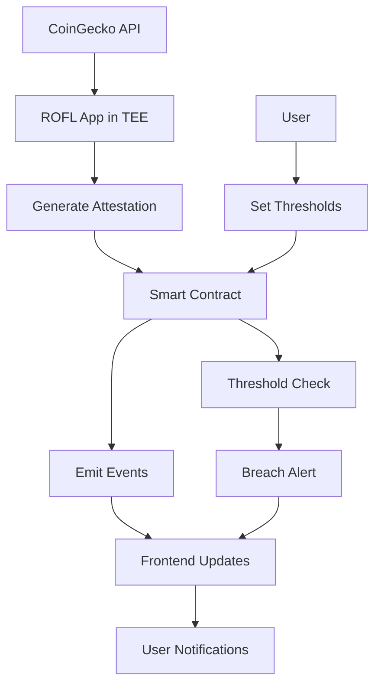

# Architecture Overview

This document provides a detailed technical overview of the Verifiable Price Oracle system architecture.

## System Components

### 1. ROFL Application (Trusted Execution Environment)

The ROFL (Runtime OFfchain Logic) application runs inside a Trusted Execution Environment (TEE) and is responsible for:

- **Price Data Fetching**: Securely retrieves ETH/USD price from CoinGecko API
- **Data Attestation**: Generates cryptographic proofs of data integrity
- **Smart Contract Integration**: Submits verified price updates to the on-chain contract
- **Threshold Monitoring**: Triggers updates when price changes exceed configured thresholds

#### Key Features:
- **Confidential Computing**: Runs in Intel SGX or similar TEE
- **Attestation Generation**: Creates verifiable proofs of execution
- **Secure API Access**: Protects API keys and sensitive data
- **Fault Tolerance**: Handles network failures and API rate limits

### 2. Smart Contract (Sapphire Network)

The on-chain component deployed on Oasis Sapphire provides:

- **Price Storage**: Maintains the latest verified price data
- **Access Control**: Ensures only authorized ROFL apps can update prices
- **Attestation Verification**: Validates TEE proofs before accepting updates
- **Event Emission**: Publishes price updates and threshold breaches
- **Threshold Management**: Configurable price alert boundaries

#### Contract Functions:
```solidity
// Core price operations
function updatePrice(uint256 price, uint256 timestamp, bytes calldata attestation)
function getLatestPrice() returns (uint256 price, uint256 timestamp)

// Threshold management
function setThresholds(uint256 upperBound, uint256 lowerBound, bool enabled)
function getThresholds() returns (ThresholdConfig memory)

// Access control
function setAppAuthorization(string calldata appId, bool authorized)
function setOracleAuthorization(address oracle, bool authorized)
```

### 3. Frontend Application (React)

The web interface provides:

- **Real-time Price Display**: Shows current ETH/USD price with verification status
- **Price History Chart**: Visualizes price movements over time
- **Threshold Configuration**: Allows contract owners to set alert boundaries
- **Alert System**: Real-time notifications for price changes and threshold breaches
- **Wallet Integration**: MetaMask connection for blockchain interaction

## Data Flow



### Detailed Flow:

1. **Price Fetching**: ROFL app periodically queries CoinGecko API for ETH/USD price
2. **Attestation Generation**: TEE creates cryptographic proof of the fetched data
3. **Threshold Evaluation**: System checks if price change exceeds configured threshold
4. **Contract Update**: If threshold exceeded, submit price update with attestation
5. **Verification**: Smart contract validates attestation and oracle authorization
6. **Storage**: Verified price data is stored on-chain with timestamp
7. **Event Emission**: Contract emits PriceUpdated event
8. **Frontend Update**: Web app receives event and updates display
9. **User Notification**: Alert system notifies users of price changes

## Security Model

### Trust Assumptions

1. **TEE Security**: Intel SGX or equivalent provides confidentiality and integrity
2. **Attestation Validity**: TEE-generated proofs are cryptographically sound
3. **Network Security**: TLS protects API communications
4. **Smart Contract Security**: Solidity code is audited and secure

### Attack Vectors and Mitigations

#### 1. Data Source Manipulation
- **Risk**: Compromised API responses
- **Mitigation**: Multiple data sources, outlier detection, TEE attestation

#### 2. Oracle Manipulation
- **Risk**: Unauthorized price updates
- **Mitigation**: Attestation verification, access control, multi-oracle setup

#### 3. Front-running Attacks
- **Risk**: MEV extraction from price updates
- **Mitigation**: Commit-reveal schemes, private mempools

#### 4. TEE Compromise
- **Risk**: Side-channel attacks, hardware vulnerabilities
- **Mitigation**: Regular attestation verification, hardware updates

## Scalability Considerations

### Current Limitations
- Single ROFL instance (single point of failure)
- On-chain storage costs for frequent updates
- API rate limits from data providers

### Scaling Solutions

#### 1. Multi-Oracle Architecture
```
┌─────────────┐    ┌─────────────┐    ┌─────────────┐
│   ROFL #1   │    │   ROFL #2   │    │   ROFL #3   │
│ (Primary)   │    │ (Backup)    │    │ (Validator) │
└─────────────┘    └─────────────┘    └─────────────┘
       │                   │                   │
       └───────────────────┼───────────────────┘
                           │
                  ┌─────────────┐
                  │ Aggregator  │
                  │  Contract   │
                  └─────────────┘
```

#### 2. Layer 2 Integration
- Deploy on Polygon or Arbitrum for lower costs
- Use state channels for high-frequency updates
- Implement rollup-based price feeds

#### 3. Caching and CDN
- Redis for price history caching
- CDN for frontend asset delivery
- WebSocket connections for real-time updates

## Performance Metrics

### Target Performance
- **Price Update Latency**: < 30 seconds from API to contract
- **Frontend Response Time**: < 2 seconds for price display
- **Attestation Generation**: < 5 seconds in TEE
- **Contract Gas Usage**: < 100,000 gas per update

### Monitoring Points
- API response times and error rates
- TEE attestation generation time
- Contract transaction success rate
- Frontend load times and user engagement

## Integration Points

### External APIs
- **CoinGecko**: Primary price data source
- **Alternative APIs**: Backup data sources (CoinMarketCap, Binance)
- **Gas Price APIs**: Dynamic gas optimization

### Blockchain Networks
- **Sapphire Testnet**: Development and testing
- **Sapphire Mainnet**: Production deployment
- **Other EVM Chains**: Cross-chain compatibility

### Infrastructure
- **Docker**: Containerized deployment
- **Kubernetes**: Orchestration and scaling
- **Monitoring**: Prometheus, Grafana, AlertManager

## Future Enhancements

### Phase 2 Features
1. **Multi-Asset Support**: BTC, ETH, and other cryptocurrencies
2. **Advanced Alerts**: Email, SMS, Discord notifications
3. **Historical Analytics**: Price trends and volatility analysis
4. **API Access**: RESTful API for third-party integrations

### Phase 3 Features
1. **Decentralized Governance**: DAO for oracle parameters
2. **Staking Mechanism**: Economic security for oracles
3. **Cross-Chain Bridge**: Multi-chain price feeds
4. **Machine Learning**: Anomaly detection and prediction

## Development Guidelines

### Code Organization
```
├── rofl-app/          # TEE application
│   ├── src/
│   │   ├── oracle.js      # Main oracle logic
│   │   ├── attestation.js # TEE attestation
│   │   └── utils/         # Helper functions
│   └── Dockerfile
├── contracts/         # Smart contracts
│   ├── contracts/
│   │   └── PriceOracle.sol
│   ├── scripts/       # Deployment scripts
│   └── test/          # Contract tests
├── frontend/          # React application
│   ├── src/
│   │   ├── components/    # UI components
│   │   ├── hooks/         # Custom hooks
│   │   └── utils/         # Helper functions
│   └── public/
└── docs/              # Documentation
```

### Testing Strategy
1. **Unit Tests**: Individual component testing
2. **Integration Tests**: End-to-end flow testing
3. **Security Tests**: Vulnerability scanning
4. **Performance Tests**: Load and stress testing
5. **TEE Tests**: Attestation verification testing

### Deployment Pipeline
1. **Development**: Local testing environment
2. **Staging**: Testnet deployment with full features
3. **Production**: Mainnet deployment with monitoring
4. **Rollback**: Automated rollback procedures
